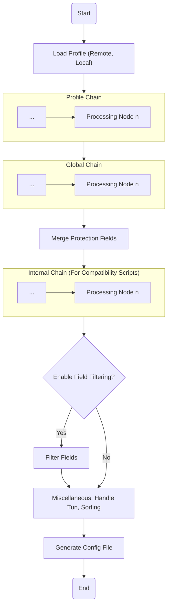

# Proxy Chains

`Clash Nyanpasu` inherits the proxy chain functionality from `Clash Verge`, allowing you to create proxy chains through either `Script` or `Merge` types. This section is adapted from the documentation of `Clash Verge`[^1].

## What is a Proxy Chain?

A proxy chain is a post-processing chain for a `Profile`. A Profile can be processed through `A`, `B`, `C`, or even more chain processing nodes, using scripts or expressions to modify configurations and produce a final proxy configuration. Multiple nodes processed in sequence form a chain structure. You can customize the chain according to your needs for different Profiles, or globally enable certain processing nodes to implement your proxy chain.

The following diagram shows the current chain processing structure.



## Merge Processing

::: tip Note
Since `1.6.0`, we have supported the use of the `.` object access operator for custom keywords, and by default, configurations are merged recursively without directly overwriting the original settings. If you need to overwrite, please use `override__x.y.z` to perform the old overwrite behavior. Additionally, we plan to introduce a new `pipeline` node for pipeline expression operations to facilitate GUI-based configuration.
:::

This processing node offers configuration merging functionality similar to `OpenClash`. It implements configuration overrides based on the following rules.

::: warning Warning
When you need to use other fields, such as `dns`, `tun`, etc., make sure to check the corresponding fields in the settings page under **_Clash Fields_**. Unchecked fields will be ignored. Additionally, Merge rules are executed **from top to bottom**.
:::

### Merge Rules

- `append__x.y.z` - Appends the content of the `x.y.z` field to the end of the existing `x.y.z` field list. If `x.y.z` does not exist or is not an array, it will be ignored, and a log warning will be triggered.
- `prepend__x.y.z` - Prepends the content of the `x.y.z` field to the beginning of the existing `x.y.z` field list. If `x.y.z` does not exist or is not an array, it will be ignored, and a log warning will be triggered.
- `override__x.y.z` - Directly overwrites the content of the `x.y.z` field. If `x.y.z` does not exist, it will be ignored, and a log warning will be triggered.
- `filter__x.y.z` - Filters the content of the `x.y.z` field using a `Lua` expression, where `item` is provided as the filter element. If `x.y.z` does not exist and is not a list, it will be ignored, and a log warning will be triggered.
- Other fields - Fields are merged recursively without directly overwriting the original configuration.

> For more use cases, refer to the [unit test cases](https://github.com/LibNyanpasu/clash-nyanpasu/blob/006b1c90c8dfe8c8d64cd063c01592bc65d8d151/backend/tauri/src/enhance/merge.rs#L174) of Merge.

## Script Processing

::: info Note
We plan to introduce the `unstable_get` method in `1.6.1` to initiate HTTP Get requests, enabling the retrieval of remote content for processing.

**For more examples, refer to the subsequent chapters**.
:::

### JavaScript Processing Node

This processing node currently offers `JavaScript` script processing functionality based on `BoaJS`, similar to the `Mixins` or _preprocessing_ functionality provided by CFW.

The script accepts a function with the signature `export default function main(config: ClashConfig): ClashConfig`, where `ClashConfig` is the type for Clash configuration. The script's return value will be used as the final configuration.

Below is an example script that adds a `proxies-provider`:

```javascript
export default function main(config) {
  const extra = {
    'rule-providers': {
      reject: {
        type: 'http',
        behavior: 'domain',
        url: 'https://cdn.jsdelivr.net/gh/Loyalsoldier/clash-rules@release/reject.txt',
        path: './ruleset/reject.yaml',
        interval: 86400
      },
      icloud: {
        type: 'http',
        behavior: 'domain',
        url: 'https://cdn.jsdelivr.net/gh/Loyalsoldier/clash-rules@release/icloud.txt',
        path: './ruleset/icloud.yaml',
        interval: 86400
      },
      apple: {
        type: 'http',
        behavior: 'domain',
        url: 'https://cdn.jsdelivr.net/gh/Loyalsoldier/clash-rules@release/apple.txt',
        path: './ruleset/apple.yaml',
        interval: 86400
      },
      google: {
        type: 'http',
        behavior: 'domain',
        url: 'https://cdn.jsdelivr.net/gh/Loyalsoldier/clash-rules@release/google.txt',
        path: './ruleset/google.yaml',
        interval: 86400
      },
      proxy: {
        type: 'http',
        behavior: 'domain',
        url: 'https://cdn.jsdelivr.net/gh/Loyalsoldier/clash-rules@release/proxy.txt',
        path: './ruleset/proxy.yaml',
        interval: 86400
      },
      direct: {
        type: 'http',
        behavior: 'domain',
        url: 'https://cdn.jsdelivr.net/gh/Loyalsoldier/clash-rules@release/direct.txt',
        path: './ruleset/direct.yaml',
        interval: 86400
      },
      private: {
        type: 'http',
        behavior: 'domain',
        url: 'https://cdn.jsdelivr.net/gh/Loyalsoldier/clash-rules@release/private.txt',
        path: './ruleset/private.yaml',
        interval: 86400
      },
      gfw: {
        type: 'http',
        behavior: 'domain',
        url: 'https://cdn.jsdelivr.net/gh/Loyalsoldier/clash-rules@release/gfw.txt',
        path: './ruleset/gfw.yaml',
        interval: 86400
      },
      greatfire: {
        type: 'http',
        behavior: 'domain',
        url: 'https://cdn.jsdelivr.net/gh/Loyalsoldier/clash-rules@release/greatfire.txt',
        path: './ruleset/greatfire.yaml',
        interval: 86400
      },
      'tld-not-cn': {
        type: 'http',
        behavior: 'domain',
        url: 'https://cdn.jsdelivr.net/gh/Loyalsoldier/clash-rules@release/tld-not-cn.txt',
        path: './ruleset/tld-not-cn.yaml',
        interval: 86400
      },
      telegramcidr: {
        type: 'http',
        behavior: 'ipcidr',
        url: 'https://cdn.jsdelivr.net/gh/Loyalsoldier/clash-rules@release/telegramcidr.txt',
        path: './ruleset/telegramcidr.yaml',
        interval: 86400
      },
      cncidr: {
        type: 'http',
        behavior: 'ipcidr',
        url: 'https://cdn.jsdelivr.net/gh/Loyalsoldier/clash-rules@release/cncidr.txt',
        path: './ruleset/cncidr.yaml',
        interval: 86400
      },
      lancidr: {
        type: 'http',
        behavior: 'ipcidr',
        url: 'https://cdn.jsdelivr.net/gh/Loyalsoldier/clash-rules@release/lancidr.txt',
        path: './ruleset/lancidr.yaml',
        interval: 86400
      },
      applications: {
        type: 'http',
        behavior: 'classical',
        url: 'https://cdn.jsdelivr.net/gh/Loyalsoldier/clash-rules@release/applications.txt',
        path: './ruleset/applications.yaml',
        interval: 86400
      }
    }
  }

  const extra_rules = [
    // Rule set begins
    'RULE-SET,applications,DIRECT',
    'DOMAIN,clash.razord.top,DIRECT',
    'DOMAIN,yacd.haishan.me,DIRECT',
    'RULE-SET,icloud,DIRECT',
    'RULE-SET,apple,Apple',
    'RULE-SET,private,DIRECT',
    'RULE-SET,reject,REJECT',
    'RULE-SET,tld-not-cn,Proxies',
    'RULE-SET,gfw,Proxies',
    'RULE-SET,telegramcidr,Telegram',
    'GEOIP,LAN,DIRECT',
    'GEOIP,CN,DIRECT'
  ]
  extra.rules = [...extra_rules, ...config.rules]
  extra.dns = { ...config.dns, enable: false }
  return { ...config, ...extra }
}
```

### Lua Processing Node

This processing node offers `Lua` script processing functionality based on `mlua`, compatible with `Lua 5.4` syntax, and provides a [safe standard library preset](https://docs.rs/mlua/latest/mlua/struct.StdLib.html#associatedconstant.ALL_SAFE).

The processing module exposes a `config` variable containing the current Clash configuration. Users can modify the `config` variable, and the returned result will be used as the final configuration.

Below is an example script that adds a `proxies-provider`:

```lua
config['rule-providers'] = {
  reject = {
    type = 'http',
    behavior = 'domain',
    url = 'https://cdn.jsdelivr.net/gh/Loyalsoldier/clash-rules@release/reject.txt',
    path = './ruleset/reject.yaml',
    interval = 86400
  },
  icloud = {
    type = 'http',
    behavior = 'domain',
    url = 'https://cdn.jsdelivr.net/gh/Loyalsoldier/clash-rules@release/icloud.txt',
    path = './ruleset/icloud.yaml',
    interval = 86400
  },
  apple = {
    type = 'http',
    behavior = 'domain',
    url = 'https://cdn.jsdelivr.net/gh/Loyalsoldier/clash-rules@release/apple.txt',
    path = './ruleset/apple.yaml',
    interval = 86400
  },
  google = {
    type = 'http',
    behavior = 'domain',
    url = 'https://cdn.jsdelivr.net/gh/Loyalsoldier/clash-rules@release/google.txt',
    path = './ruleset/google.yaml',
    interval = 86400
  },
  proxy = {
    type = 'http',
    behavior = 'domain',
    url = 'https://cdn.jsdelivr.net/gh/Loyalsoldier/clash-rules@release/proxy.txt',
    path = './ruleset/proxy.yaml',
    interval = 86400
  },
  direct = {
    type = 'http',
    behavior = 'domain',
    url = 'https://cdn.jsdelivr.net/gh/Loyalsoldier/clash-rules@release/direct.txt',
    path = './ruleset/direct.yaml',
    interval = 86400
  },
  private = {
    type = 'http',
    behavior = 'domain',
    url = 'https://cdn.jsdelivr.net/gh/Loyalsoldier/clash-rules@release/private.txt',
    path = './ruleset/private.yaml',
    interval = 86400
  },
  gfw = {
    type = 'http',
    behavior = 'domain',
    url = 'https://cdn.jsdelivr.net/gh/Loyalsoldier/clash-rules@release/gfw.txt',
    path = './ruleset/gfw.yaml',
    interval = 86400
  },
  greatfire = {
    type = 'http',
    behavior = 'domain',
    url = 'https://cdn.jsdelivr.net/gh/Loyalsoldier/clash-rules@release/greatfire.txt',
    path = './ruleset/greatfire.yaml',
    interval = 86400
  },
  ['tld-not-cn'] = {
    type = 'http',
    behavior = 'domain',
    url = 'https://cdn.jsdelivr.net/gh/Loyalsoldier/clash-rules@release/tld-not-cn.txt',
    path = './ruleset/tld-not-cn.yaml',
    interval = 86400
  },
  telegramcidr = {
    type = 'http',
    behavior = 'ipcidr',
    url = 'https://cdn.jsdelivr.net/gh/Loyalsoldier/clash-rules@release/telegramcidr.txt',
    path = './ruleset/telegramcidr.yaml',
    interval = 86400
  },
  cncidr = {
    type = 'http',
    behavior = 'ipcidr',
    url = 'https://cdn.jsdelivr.net/gh/Loyalsoldier/clash-rules@release/cncidr.txt',
    path = './ruleset/cncidr.yaml',
    interval = 86400
  },
  lancidr = {
    type = 'http',
    behavior = 'ipcidr',
    url = 'https://cdn.jsdelivr.net/gh/Loyalsoldier/clash-rules@release/lancidr.txt',
    path = './ruleset/lancidr.yaml',
    interval = 86400
  },
  applications = {
    type = 'http',
    behavior = 'classical',
    url = 'https://cdn.jsdelivr.net/gh/Loyalsoldier/clash-rules@release/applications.txt',
    path = './ruleset/applications.yaml',
    interval = 86400
  }
}

local extra_rules = {
  -- Rule set begins
  'RULE-SET,applications,DIRECT',
  'DOMAIN,clash.razord.top,DIRECT',
  'DOMAIN,yacd.haishan.me,DIRECT',
  'RULE-SET,icloud,DIRECT',
  'RULE-SET,apple,Apple',
  'RULE-SET,private,DIRECT',
  'RULE-SET,reject,REJECT',
  'RULE-SET,tld-not-cn,Proxies',
  'RULE-SET,gfw,Proxies',
  'RULE-SET,telegramcidr,Telegram',
  'GEOIP,LAN,DIRECT',
  'GEOIP,CN,DIRECT'
}

config.rules = {table.unpack(extra_rules), table.unpack(config.rules)}
config.dns = {enable = false, ...config.dns}

return config
```

## References

[^1]: [Clash Verge - Proxy Chain](https://github.com/zzzgydi/clash-verge/wiki/%E4%BD%BF%E7%94%A8%E6%8C%87%E5%8D%97)
