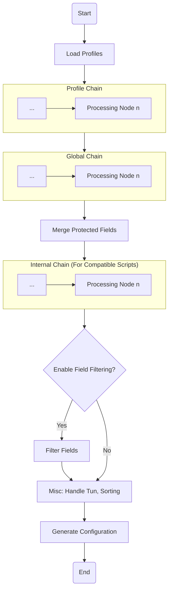

# Proxy Chain

`Clash Nyanpasu` inherits the proxy chain feature from `Clash Verge` and can implement a proxy chain through two types of chains: `Script` or `Merge`. The content of this section is adapted from `Clash Verge` documentation[^1].

## What is a Proxy Chain?

A proxy chain refers to the post-processing chain of a `Profile`. A profile can go through nodes such as `A`, `B`, `C`, or even more chain processing nodes, where the configuration is modified using scripts or expressions to generate a final proxy configuration. Multiple nodes are processed sequentially, forming a chain structure. You can customize the chain to enable certain nodes for different profiles or globally, thereby creating your own proxy chain.

The following diagram shows the current chain processing structure.



## Merge Processing

::: tip Note
Starting from version `1.6.0`, we have enabled custom keywords to support the `.` object access operator and perform recursive merging by default, avoiding direct overwriting of existing configurations. If you need to override, use `override__x.y.z` to apply the old behavior.
Additionally, we plan to introduce a new `pipeline` node for pipeline expression operations, simplifying GUI-based configuration.
:::

This processing node provides configuration merging functionality similar to `OpenClash`. It achieves this by defining the following rules for overwriting configurations.

::: warning Note
When using other fields like `dns`, `tun`, etc., you need to select the corresponding fields in the **_Clash Fields_** section on the settings page. Fields that are not selected will be ignored.
Moreover, Merge rules are executed in **top-down order**.
:::

### Merge Rules

- `append__x.y.z` - Appends the content of the `x.y.z` field to the end of the original `x.y.z` list. If `x.y.z` does not exist or is not an array, it will be ignored, and a log warning will be triggered.
- `prepend__x.y.z` - Adds the content of the `x.y.z` field to the beginning of the original `x.y.z` list. If `x.y.z` does not exist or is not an array, it will be ignored, and a log warning will be triggered.
- `override__x.y.z` - Directly overrides the content of the `x.y.z` field. If `x.y.z` does not exist, it will be ignored, and a log warning will be triggered.
- `filter__x.y.z` - Filters or modifies the content of the `x.y.z` field. For supported types, refer to [`filter` Supported Operations](#filter-supported-operations).
- Other fields - Fields are recursively merged and will not directly overwrite the original configuration.

> More examples can be found in the [Merge Unit Test Cases](https://github.com/LibNyanpasu/clash-nyanpasu/blob/main/backend/tauri/src/enhance/merge.rs#L320).

#### `filter` Supported Operations

##### Filtering Lists

The `filter__x.y.z: string` operation filters a list using a Lua expression where `item` represents the current element. The expression must return a `bool`. If the expression encounters an error, a log warning will be triggered.  
Here is an example of removing `trojan` proxies:

```yaml
filter__proxies: |
  item.type ~= 'trojan'
```

##### Modifying Lists Using Expressions

This operation is similar to the `map` operation in other languages. It modifies matched items using the `expr` expression. The syntax is as follows:

```yaml
filter__x.y.z:
  when: string # Lua expression, where item is the current element, returns a boolean value
  expr: string # Lua expression, where item is the current element, returns the modified item
```

Here’s an example of modifying the `port` of `trojan` proxies to `443`:

```yaml
filter__proxies:
  when: |
    item.type == 'trojan'
  expr: |
    item.port = 443
    return item
```

##### Merging Fields

This operation is similar to the `map` operation in other languages, merging matched items using the `merge` table. The syntax is as follows:

```yaml
filter__x.y.z:
  when: string # Lua expression, where item is the current element, returns a boolean value
  merge: object # Object to be merged recursively, future support for arrays might be considered
```

Here is an example of adding the `icon` field to the `Spotify` proxy group:

```yaml
filter__proxy-groups:
  when: |
    item.name == 'Spotify'
  merge:
    icon: 'https://example.com/spotify.png'
```

##### Directly Overwriting Fields

This operation is similar to the `map` operation in other languages but directly overwrites the matched item. The syntax is as follows:

```yaml
filter__x.y.z:
  when: string # Lua expression, where item is the current element, returns a boolean value
  override: any # Value to override
```

Here is an example of forcibly overriding the `Spotify` proxy group:

```yaml
filter__proxy-groups:
  when: |
    item.name == 'Spotify'
  override:
    name: 'Spotify'
    type: select
    proxies:
      - Proxies
      - DIRECT
      - HK
      - JP
      - SG
      - TW
      - US
```

##### Removing Fields

This operation is similar to the `map` operation in other languages but removes keys from the matched item using the `remove` field. The syntax is as follows:

```yaml
filter__x.y.z:
  when: string # Lua expression, where item is the current element, returns a boolean value
  remove: Array<string | int> # List of keys to remove. Keys are strings for objects and numbers for arrays.
```

Here’s an example of removing the first proxy from the `proxies` field of the `Spotify` proxy group:

```yaml
filter__proxy-groups:
  when: |
    item.name == 'Spotify'
  remove:
    - proxies.0
```

##### Chained Operations

The `filter` operation supports list types, where each element is a `filter` operation. This allows for chained processing of multiple operations.

Here’s an example that adds the `icon` field to both the `Spotify` and `Netflix` proxy groups:

```yaml
filter__proxy-groups:
  - when: |
      item.name == 'Spotify'
    merge:
      icon: 'https://example.com/spotify.png'
  - when: |
      item.name == 'Netflix'
    merge:
      icon: 'https://example.com/netflix.png'
```

## Script Processing

::: info Note

We plan to introduce the `unstable_get` method in version `1.6.2`, allowing HTTP GET requests to fetch remote content for processing.

**For more examples, please refer to the next section.**
:::

### JavaScript Node

This processing node currently provides JavaScript processing based on `BoaJS`, similar to the `Mixins` or preprocessing feature in CFW.

The script accepts a function with the signature `export default function main(config: ClashConfig): ClashConfig`, where `ClashConfig` is the Clash configuration type. The return value of the script will be used as the final configuration.

Here’s an example of adding `rules` through a script:

```javascript
export default function main(config) {
  const rules = ['DOMAIN-SUFFIX,google.com,PROXY', 'DOMAIN,example.org,PROXY']
  config.rules = [...config.rules, ...rules]
  return config
}
```

### Lua Processing Node

This processing node provides Lua scripting functionality based on `mlua`, compatible with `Lua 5.4` syntax, and includes a [secure standard library preset](https://docs.rs/mlua/latest/mlua/struct.StdLib.html#associatedconstant.ALL_SAFE).

The processing module exposes a `config` variable that contains the current Clash configuration. Users can modify the `config` variable, and the result will be used as the final configuration.

Here’s an example of adding `rules` through a Lua script:

```lua
local rules = {
  'DOMAIN-SUFFIX,google.com,PROXY',
  'DOMAIN,example.org,PROXY',
}

for _, rule in ipairs(rules) do
  table.insert(config.rules, rule)
end

return config
```

## References

[^1]: [Clash Verge - Proxy Chain](https://github.com/zzzgydi/clash-verge/wiki/%E4%BD%BF%E7%94%A8%E6%8C%87%E5%8D%97)
