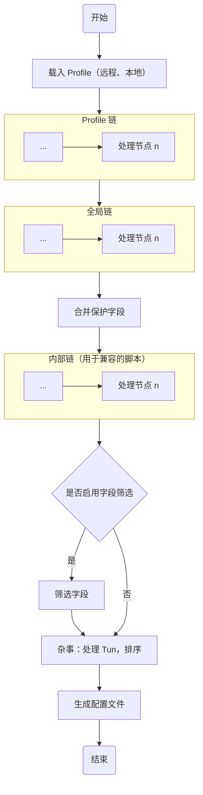

# 代理链

`Clash Nyanpasu` 继承了 `Clash Verge` 的代理链功能，可以通过 `Script` 或 `Merge` 两种 链 类型来实现代理链。本节内容引自并改编自 `Clash Verge` 的文档[^1]。

## 什么是代理链？

代理链，即 `Profile` 的后处理链。一个 Profile 可以通过 `A`、`B`、`C` 甚至更多的链处理节点，通过脚本、表达式修改配置，生成出一个最终的代理配置。
多个节点依次处理构成了一个链式结构，可以按照自己的需求针对不同的 Profile，或者全局启用某些处理节点，实现自己的代理链。

下图是目前的链式处理结构。



## Merge（合并）处理

::: tip 提示
自 `1.6.0` 起，我们使自定义关键字支持了 `.` 对象访问操作符，且默认递归合并，不会直接覆盖原有配置。如果需要覆盖，请使用 `override__x.y.z` 执行旧覆盖行为。
此外，我们正计划引入一个新的 `pipeline`（流水线）节点，用于流水线表达式操作，方便配置 GUI 化。

:::

此处理节点提供了类似 `OpenClash` 的配置合并功能。它通过定义了以下规则，实现了对配置的覆盖。

::: warning 注意
需要使用其他字段时，例如 `dns`, `tun` 等，需要在设置页 - **_Clash 字段_** 里勾选对应的字段，不勾选的字段将被忽略。
此外，Merge 规则执行顺序 **由上至下**。
:::

### 合并规则

- `append__x.y.z` - 将 `x.y.z` 字段的内容追加到原有配置的 `x.y.z` 字段列表末尾。当 `x.y.z` 不存在，或者不是一个数组时，将会被忽略并触发日记警告。
- `prepend__x.y.z` - 将 `x.y.z` 字段的内容追加到原有配置的 `x.y.z` 字段列表开头。当 `x.y.z` 不存在，或者不是一个数组时，将会被忽略并触发日记警告。
- `override__x.y.z` - 直接覆盖 `x.y.z` 字段的内容。当 `x.y.z` 不存在时，将会被忽略并触发日记警告。
- `filter__x.y.z` 过滤或修改 `x.y.z` 字段的内容。具体支持类型请见 [`filter` 支持的操作](#filter-支持的操作)。
- 其他字段 - 递归合并字段，不会直接覆盖原有配置。

> 更多用例可以参考 Merge 的 [单元测试用例](https://github.com/LibNyanpasu/clash-nyanpasu/blob/main/backend/tauri/src/enhance/merge.rs#L320)。

#### `filter` 支持的操作

##### 过滤列表

通过 `filter__x.y.z: string` 过滤列表，filter 采用 Lua 的表达式，传入 `item` 作为当前项，表达式返回值须为 `bool` 类型。当表达式出现错误时，将会触发日记警告。  
以下是一个删除 `trojan` 代理的示例：

```yaml
filter__proxies: |
  item.type ~= 'trojan'
```

##### 使用表达式修改列表

此操作类似其他语言的 `map` 操作，通过 `expr` 表达式修改匹配的项。语法定义如下：

```yaml
filter__x.y.z:
  when: string # Lua 表达式，item 为当前项，返回值为 bool 类型
  expr: string # Lua 表达式，item 为当前项，返回值为修改后的项
```

以下是一个将 `trojan` 代理的 `port` 修改为 `443` 的示例：

```yaml
filter__proxies:
  when: |
    item.type == 'trojan'
  expr: |
    item.port = 443
    return item
```

##### 合并字段

此操作类似其他语言的 `map` 操作，通过 `merge` 表合并匹配的项。语法定义如下：

```yaml
filter__x.y.z:
  when: string # Lua 表达式，item 为当前项，返回值为 bool 类型
  merge: object # 合并的对象，递归合并，未来可能考虑支持数组？
```

以下是一个为 `Spotify` 代理组添加 `icon` 字段的示例：

```yaml
filter__proxy-groups:
  when: |
    item.name == 'Spotify'
  merge:
    icon: 'https://example.com/spotify.png'
```

##### 直接覆盖字段

此操作类似其他语言的 `map` 操作，但是直接覆盖匹配的项。语法定义如下：

```yaml
filter__x.y.z:
  when: string # Lua 表达式，item 为当前项，返回值为 bool 类型
  override: any # 覆盖的值
```

以下是一个强制覆盖 `Spotify` 代理组的示例：

```yaml
filter__proxy-groups:
  when: |
    item.name == 'Spotify'
  override:
    name: 'Spotify'
    type: select
    proxies:
      - Proxies
      - DIRECT
      - HK
      - JP
      - SG
      - TW
      - US
```

##### 删除字段

此操作类似其他语言的 `map` 操作，但是通过 `remove` 字段移除匹配的项中的键。语法定义如下：

```yaml
filter__x.y.z:
  when: string # Lua 表达式，item 为当前项，返回值为 bool 类型
  remove: Array<string | int> # 需要移除的键列表。对于对象，键为字符串；对于数组，键为数字。
```

以下是一个示范移除 `Spotify` 代理组的 `proxies` 字段中第一个代理的示例：

```yaml
filter__proxy-groups:
  when: |
    item.name == 'Spotify'
  remove:
    - proxies.0
```

##### 链式操作

`filter` 操作支持列表类型，其中每个元素都是一个 `filter` 操作。这样可以实现多个操作的链式处理。

以下是一个示例，分别为 `Spotify`，`Netflix` 代理组添加 `icon` 字段：

```yaml
filter__proxy-groups:
  - when: |
      item.name == 'Spotify'
    merge:
      icon: 'https://example.com/spotify.png'
  - when: |
      item.name == 'Netflix'
    merge:
      icon: 'https://example.com/netflix.png'
```

## Script（脚本）处理

::: info 提示

我们计划在 `1.6.2` 引入 `unstable_get` 方法，用于发起 HTTP Get 请求，以便获得一些远程内容进行处理。

**更多的示例，请参考后一章节**。
:::

### JavaScript 节点

此处理节点目前提供了基于 `BoaJS` 的 `JavaScript` 脚本处理功能，类似于 CFW 提供的 `Mixins` 或 _预处理_ 功能。

脚本接受一个方法签名为 `export default function main(config: ClashConfig): ClashConfig` 的方法，其中 `ClashConfig` 是 Clash 的配置类型。脚本的返回值将作为最终的配置。

以下是一个添加 `rules` 的脚本示例：

```javascript
export default function main(config) {
  const rules = ['DOMAIN-SUFFIX,google.com,PROXY', 'DOMAIN,example.org,PROXY']
  config.rules = [...config.rules, ...rules]
  return config
}
```

### Lua 处理节点

此处理节点提供了基于 `mlua` 提供的 `Lua` 的脚本处理功能，兼容 `Lua 5.4` 的语法，并提供[安全标准库预设](https://docs.rs/mlua/latest/mlua/struct.StdLib.html#associatedconstant.ALL_SAFE)。

该处理模块暴露一个 `config` 变量，里面包含当前的 Clash 配置。用户可以修改 `config` 变量，返回结果将作为最终的配置。

以下是一个添加 `rules` 的脚本示例：

```lua
local rules = {
  'DOMAIN-SUFFIX,google.com,PROXY',
  'DOMAIN,example.org,PROXY',
}

for _, rule in ipairs(rules) do
  table.insert(config.rules, rule)
end

return config
```

## 引用

[^1]: [Clash Verge - 代理链](https://github.com/zzzgydi/clash-verge/wiki/%E4%BD%BF%E7%94%A8%E6%8C%87%E5%8D%97)
